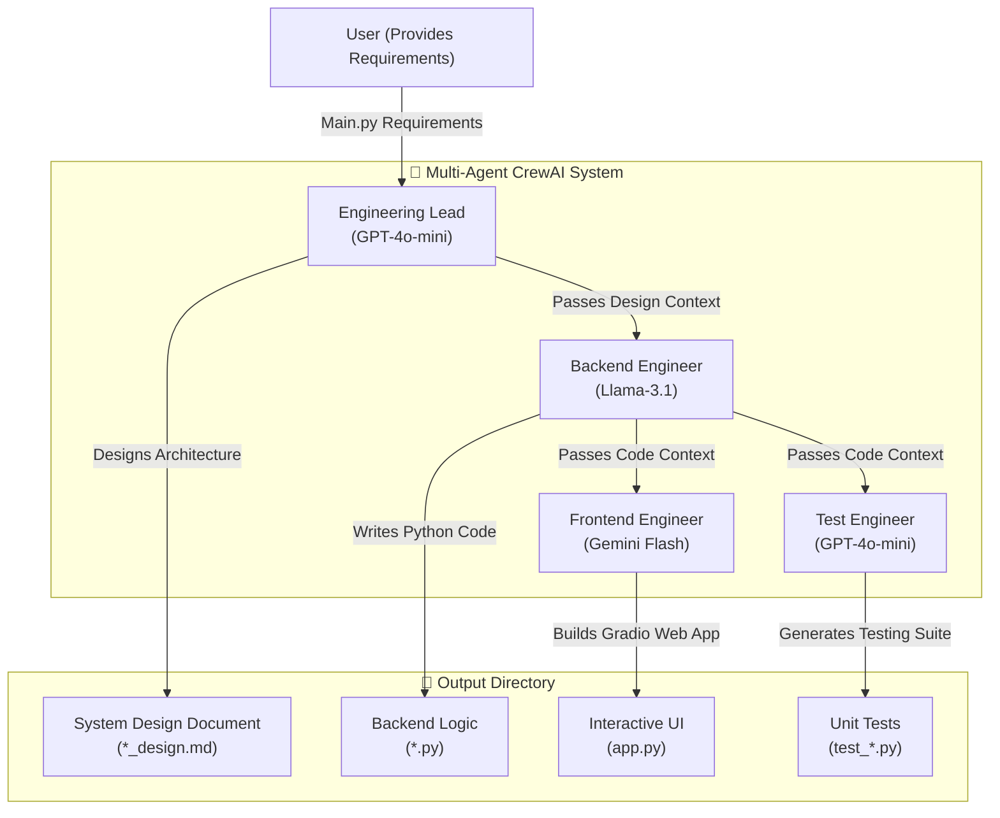

# Multi-Agent Software Engineering Crew

An autonomous AI agent team built with [CrewAI](https://crewai.com) that automates the end-to-end software development lifecycle. This system takes high-level natural language requirements and orchestrates a collaborative workflow between specialized AI agents to generate system architecture, functional backend code, interactive UIs, and comprehensive unit tests.

## Architecture

The project leverages a multi-agent system where each agent is assigned a specific role and equipped with an optimized LLM to handle discrete phases of software development.



### Agent Roles

1. **Engineering Lead (`gpt-4o-mini`)**: Analyzes the high-level requirements and produces a detailed technical design document (`*_design.md`).
2. **Backend Engineer (`llama-3.1-8b-instant` via Groq)**: Implements the technical design into a complete, self-contained Python module.
3. **Frontend Engineer (`gemini-2.5-flash-lite`)**: Builds an interactive Gradio web application (`app.py`) to demonstrate and interact with the backend logic.
4. **Test Engineer (`gpt-4o-mini`)**: Writes comprehensive unit tests (`test_*.py`) to ensure the reliability and correctness of the generated backend module.

All generated artifacts are automatically saved to the `output/` directory.

## 🛠️ Tech Stack

- **Framework**: CrewAI
- **LLMs**: OpenAI (GPT-4o-mini), Groq (Llama-3.1), Google GenAI (Gemini)
- **UI & Tools**: Gradio, Python, uv (dependency management)

## ⚙️ Installation & Setup

Ensure you have Python >=3.10 and <3.14 installed on your system. This project uses [uv](https://docs.astral.sh/uv/) for fast dependency management.

1. **Clone the repository:**
   ```bash
   git clone <your-repo-url>
   cd team
   ```

2. **Install `uv` (if not already installed):**
   ```bash
   pip install uv
   ```

3. **Install dependencies:**
   ```bash
   crewai install
   ```

4. **Environment Variables:**
   Create a `.env` file in the root directory and add the required API keys for the respective LLM providers:
   ```env
   OPENAI_API_KEY=your_openai_key
   GROQ_API_KEY=your_groq_key
   GEMINI_API_KEY=your_gemini_key
   ```

## Running the Project

To execute the multi-agent crew, run the following command from the root directory:

```bash
crewai run
```

Or alternatively:

```bash
python -m team.main
```

By default, the agents will read the requirements defined in `src/team/main.py` (e.g., building an inventory management system) and output the resulting architecture document, python classes, UI, and test files into the `output/` directory.

## Customizing Requirements

You can change the software being built by updating the `requirements` variable inside `src/team/main.py`. Provide detailed natural language instructions, and the crew will adapt and generate the requested software.
